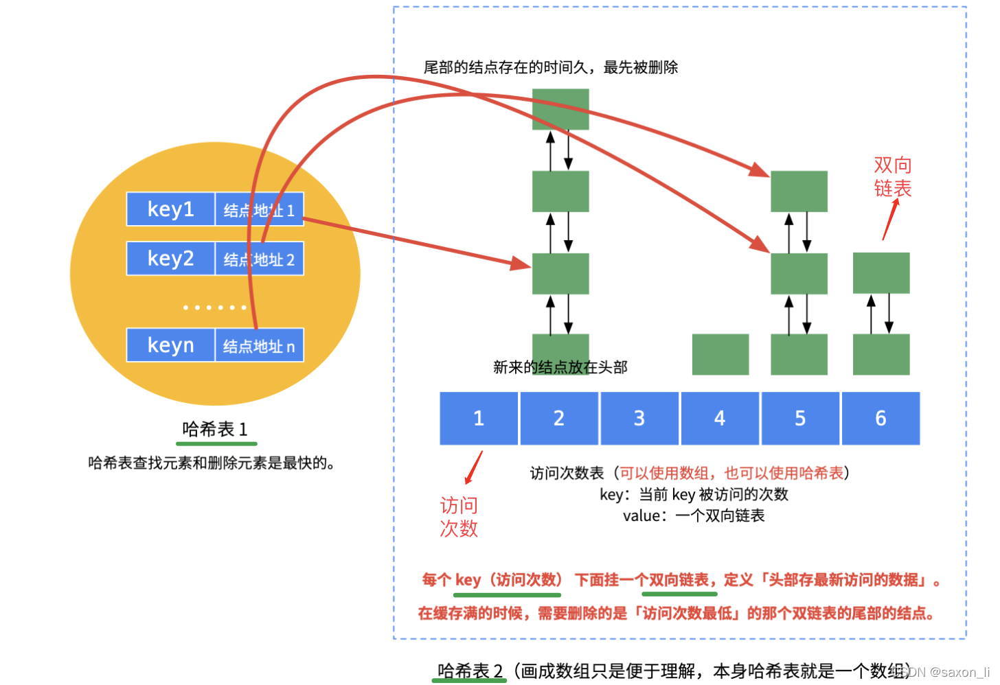

# LFU算法
* LRU算法有一个明显的问题相信大家已经看出来了，它无法区分**热点数据**和**冷数据**，对于热点数据有淘汰的风险
## 定义
** 最不经常使用**，它的设计原则使用了**概率**思想，该算法认为如果一个对象的**被访问频率**很低，那么再次被访问的概率也越低。其原理是缓存空间中被访问次数最少的数据应该最早被淘汰掉，即当缓存空间被占满时，缓存内**被访问频率**最少的数据将被置换走。

## 算法实现
==哈希表==，==双向链表==
与LRU算法相同，都使用哈希表与双向链表，但是不同的是，我们实现的是两部分，一部分是节点与键映射的哈希表，另一部分是访问频次与该访问频次下的节点链表映射的哈希表。
* 也可以说该算法使用了两个哈希表，一个是键值与节点的映射，一个是节点访问频次与该频次下节点构成的链表的映射

## 基础LFU（力扣）
这里是在力扣上完成的LFU基础版本，感兴趣的话也可以到力扣上试试这道hard题，相信做完之后对于我们的缓存系统有更大自信！
[LFU缓存](https://leetcode.cn/problems/lfu-cache/description/)

###代码
```
class LFUCache {
private:
//定义双向链表的节点
struct Node{
    int key;//键
    int value;//值
    int freq;//节点访问频率
    Node *pre,*next;//节点的前驱和后继指针
    Node (int key,int value,int freq)
    {
        this->key=key;
        this->value=value;
        this->freq=freq;
        pre=nullptr;
        next=nullptr;
    }
};
struct FreqList{//访问频数的链表，里面包含频数和前后哨兵节点指针
    int freq;
    Node *L,*R;//哨兵节点
    //构造函数
    FreqList(int freq){
        this->freq=freq;
        L=new Node(-1,-1,1);
        R=new Node(-1,-1,1);//构造左右哨兵节点
        L->next=R;
        R->pre=L;//将二者相连，实现链表的初始化
    }
};
int n;//缓存空间大小

int minFreq;//最小访问频数,这里的最小访问频数是为了解决快速找到频数哈希表末端的链表
unordered_map <int,Node*> hashNode;//节点与键的哈希表，用于快速获取key对应的节点信息
unordered_map <int,FreqList*> hashFreq;//频数双向链表哈希表，为每个访问频数都构造一个双向链表
//从双向链表中移除对应节点
void deleteFromList(Node *node){
    Node *pre=node->pre;
    Node *next=node->next;

    pre->next=next;
    next->pre =pre;

}

void append(Node *node){
    //获取该节点对应频数
    int freq=node->freq;
    //若在频数哈希表中未找到该频数，说明重新创建对应访问频数的链表
    if(hashFreq.find(freq)==hashFreq.end()){
        hashFreq[freq]=new FreqList(freq);
    }
    FreqList *curList=hashFreq[freq];
    
    Node *pre=curList->R->pre;//该链表末端最后一个节点
    Node *next=curList->R;//链表末端

    pre->next=node;
    node->next=next;

    next->pre=node;
    node->pre=pre;
    
}

public:
    LFUCache(int capacity) {
        n=capacity;
        minFreq=0;

    }
    
    int get(int key) {
        if(hashNode.find(key)!=hashNode.end()){
        Node *node=hashNode[key];//通过哈希节点表获取对应节点
        deleteFromList(node);
        node->freq++;//调用node的访问频数，并加1

        if(hashFreq[minFreq]->L->next==hashFreq[minFreq]->R)
            minFreq++;
        //如果删除该节点后，最小访问频数对应的链表为空（前后指针对指），则将最小访问频数加1
        append(node);
        return node->value;
        }
            else return -1;

    }
    
    void put(int key, int value) {
        if(n==0) return ;
        if(get(key)!=-1){
            hashNode[key]->value=value;//如果已经存在缓存中，则只需要更新数据即可
        }
         else{
            if(hashNode.size()==n)//缓存已满，需要删除最小访问频数中的一个节点
            {
                Node *node=hashFreq[minFreq]->L->next;//找到最小访问频数中最后一个节点，这个节点在访问次数最小，访问时间最早，可以删除
                deleteFromList(node);//在链表中删除
                hashNode.erase(node->key);//在节点哈希表中删除
            }
            //因为需要添加新节点，无论如何都需要完成以下步骤
            Node *newnode=new Node(key,value,1);//构造新节点，将访问频数为1
            hashNode[key]=newnode;//在节点哈希表中插入该值
            minFreq=1;//因为插入的新节点的访问频数一定为1，所以修改最小访问次数为1
            append(newnode);
         }
    }
};

```
注释写的很详细就不过多阐述

## LFU(最大平均访问次数限制)
### 定义
在LFU算法之上，引入访问次数平均值概念，当平均值大于最大平均值限制时将所有结点的访问次数减去最大平均值限制的一半或者一个固定值。

防止某些老东西滚雪球，在一段时间访问频次过高导致一直赖在缓存里面。同时，一定程度上对于新加入的数据进行保护，因为新加入的数据都是访问频次1，这时候如果老的热点数据过多，就容易排挤新数据

### 算法实现
==哈希表== ，==双向链表==
和前面类似，只是在这里会使用面向对象的形式来实现，并且会增加一些能够处理和计算访问频次的函数

### 代码
```
	//提前声明lfu为模板
	template <typename Key, typename Value> class CopLfuCache;

	template <typename Key,typename Value>
	class FreqList//频数双向链表
	{
	private:
		//构造节点结构体
		struct Node
		{
			int freq;//访问频次
			Key key;
			Value value;
			std::shared_ptr<Node> pre;
			std::shared_ptr<Node> next;//指向节点的智能指针，提供前驱和后继两种指针，构造成为双向链表需要

			//提供Node的无参构造函数,初始化列表
			Node()
				:freq(1),pre(nullptr),next(nullptr){}
			//有参构造函数
			Node(Key key,Value value)
				:freq(1),key(key),value(value),pre(nullptr),next(nullptr){}
		};
		using NodePtr = std::shared_ptr<Node>;//使用Nodeptr代替构造智能指针的代码,用来声明Node节点的智能指针
		int freq_;//注意，虽然每个节点都有自己的访问次数，但是这里的访问次数代表该链表代表的访问次数
		NodePtr head_;
		NodePtr tail_;//每个链表的哨兵节点

	public:
		explicit FreqList(int n)
			:freq_(n)//explicit防止隐式转换，频数链表的构造函数
		{
			head_ = std::make_shared<Node>();
			tail_ = std::make_shared<Node>();
			head_->next = tail_;
			tail_->pre = head_;//首尾相连，构造初始链表

		}

		bool isEmpty() const//判断链表中是否为空
		{
			return head_->next == tail_;
		}

		void addNode(NodePtr node) {//添加节点
			if (!node || !head_ || !tail_)//添加的节点存在问题则排除
				return;

			node->pre = tail_->pre;
			node->next = tail_;
			
			tail_->pre->next = node;
			tail_->pre = node;
			
		}

		void removeNode(NodePtr node)//移除节点
		{
			if (!node || !head_ || !tail_) {
				return;
			}

			if (!node->pre || !node->next)
				return;

			node->pre->next = node->next;
			node->next->pre = node->pre;
			node->pre = nullptr;
			node->next = nullptr;
		}

		NodePtr getFirstNode() const {//获取对应链表的首个节点
			return head_->next;
		}

		friend class CopLfuCache<Key, Value>;
		//将后面的lfu添加到频数链表类中作为友元函数


	};

	template <typename Key,typename Value>
	class CopLfuCache :public CopCachePolicy<Key, Value>
	{
	public:
		//代码别名
		using Node = typename FreqList<Key, Value>::Node;//代替频数链表中的节点构造函数	
		using NodePtr = std::shared_ptr<Node>;//更换作用域需要重新写声明节点指针的代替
		using NodeMap = std::unordered_map<Key, NodePtr>;//节点哈希表

		//构造函数,设置最大平均访问频次，并且将初始的平均访问频次和访问频次总和设置为0
		CopLfuCache(int capacity,int maxAverageNum = 10)
			:capacity_(capacity),minFreq_(INT8_MAX),maxAverageNum_(maxAverageNum),
			curAverageNum_(0),curTotalNum_(0)
		{}

		~CopLfuCache() override = default;//使用默认析构函数

		void put(Key key, Value value) override
		{
			if (capacity_ == 0)
				return;

			//线程锁
			std::lock_guard <std::mutex> lock(mutex_);
			auto it = nodeMap_.find(key);
			//如果能在哈希表中能够找到对应节点
			if (it != nodeMap_.end())
			{
				//更新节点值
				it->second->value = value;

				//因为访问需要增加一次访问次数
				getInternal(it->second, value);
				return;

			}

			putInternal(key, value);
		}


		bool get(Key key, Value& value) override
		{
			std::lock_guard <std::mutex> lock(mutex_);
			auto it = nodeMap_.find(key);
			if (it != nodeMap_.end()) {
				//将传入value修改后传出
				getInternal(it->second, value);
				return true;
			}
			return false;
		}

		Value get(Key key) override
		{
			Value value;
			get(key, value);
			return value;
		}


		//清空缓存，清空节点哈希表和频次频次链表哈希表
		void purge()
		{
			nodeMap_.clear();
			freqToFreqList_.clear();
		}


	private:
		//先声明函数，后面会在类外逐步实现（总之先喊出来说明自己要用）
		void putInternal(Key key, Value value);//添加缓存
		void getInternal(NodePtr node, Value& value);//获取缓存

		void kickOut();//移除缓存中的过期数据

		void removeFromFreqList(NodePtr node);//从频数链表中移除节点

		void addToFreqList(NodePtr node);//添加到频数中
		
		void addFreqNum();//增加平均访问等频率
		void decreaseFreqNum(int num);//减少平均访问等频率

		void handleOverMaxAverageNum();//处理当前平均访问频数超过上限的情况
		void updateMinFreq();//上传最小频数


	private:
		int capacity_;//缓存容量
		int minFreq_;//最小访问频次，用于找到链表末端
		int maxAverageNum_;//最大平均访问频次
		int curAverageNum_;//当前平均访问频次
		int curTotalNum_;//当前所有访问频次总数
		std::mutex mutex_;
		NodeMap nodeMap_;
		std::unordered_map<int, FreqList<Key, Value>*> freqToFreqList_;//访问频次对该访问频次链表的映射哈希表
		
	};

	//逐步类外实现函数

	//获取节点值
	template <typename Key,typename Value>
	void CopLfuCache<Key, Value> ::getInternal(NodePtr node, Value& value)
	{
		//和lru不同，在lfu获取节点后，需要移除当前节点，并且将该节点移动到+1的访问频次链表中
		// 获取值
		value=node->value;
		//从原来的链表中移除节点,将访问频次+1
		removeFromFreqList(node);
		node->freq++;
		addToFreqList(node);
		
		if (node->freq - 1 == minFreq_ && freqToFreqList_[node->freq - 1]->isEmpty())
			minFreq_++;


		//同样，需要更新总访问频次和当前平均访问频次

		addFreqNum();
			
	}

	//加入节点到缓存
	template <typename Key, typename Value>
	void CopLfuCache<Key, Value> ::putInternal(Key key, Value value)
	{
		//当调用put函数时，如果节点未在缓存中，则需要放入缓存链表中
		if (nodeMap_.size() == capacity_)
		{
			//缓存满时需要驱逐节点
			kickOut();
		}
		//构造节点并将节点放入哈希表和链表中
		NodePtr node = std::make_shared<Node>(key, value);
		nodeMap_[key] = node;
		addToFreqList(node);
		//并且更新中访问频数和当前平均访问频次
		addFreqNum();
		//因为新添加了节点，minFreq更新，minFrq初始化时可能有0的存在
		minFreq_ = std::min(minFreq_, 1);

	}

	//驱逐最久最少用的节点
	template <typename Key, typename Value>
	void CopLfuCache<Key, Value> ::kickOut()
	{
		//获取链表中访问频次最低且时间最久的节点，删除并更新访问频次总数和平均值
		NodePtr node = freqToFreqList_[minFreq_]->getFirstNode();
		removeFromFreqList(node);
		nodeMap_.erase(node->key);
		decreaseFreqNum(node->freq);

	}

	//移除对应节点
	template <typename Key, typename Value>
	void CopLfuCache<Key, Value> ::removeFromFreqList(NodePtr node)
	{
		//节点为空则不处理
		if (!node)
			return;
		//调用freqList类的函数处理节点
		auto freq = node->freq;
		freqToFreqList_[freq]->removeNode(node);
	}

	//添加节点到链表中
	template <typename Key, typename Value>
	void CopLfuCache<Key, Value> ::addToFreqList(NodePtr node)
	{
		if (!node)
			return;
		//添加到相应的频次链表中，但先需要判断是否存在该链表，不存在还需要构造一个
		auto freq = node->freq;
		if (freqToFreqList_.find(node->freq) == freqToFreqList_.end())
		{
			freqToFreqList_[node->freq] = new FreqList<Key, Value>(node->freq);

		}
		freqToFreqList_[freq]->addNode(node);

	}

	//增加频次总数和平均数
	template <typename Key, typename Value>
	void CopLfuCache<Key, Value> ::addFreqNum()
	{
		//当前总数增加
		curTotalNum_++;
		//判断哈希表是否为空，计算平均频次数
		if (nodeMap_.empty())
			curAverageNum_ = 0;
		else
			curAverageNum_ = curTotalNum_ / nodeMap_.size();

		//如果当前平均访问频数已经超过最大限制，启动处理函数
		if (curAverageNum_ > maxAverageNum_)
		{
			handleOverMaxAverageNum();
		}
	}

	//对应上面减少这些值
	template <typename Key, typename Value>
	void CopLfuCache<Key, Value> ::decreaseFreqNum(int num)
	{
		//减少平均访问频次和总访问频次
		curTotalNum_ -= num;
		//然后更新平均数即可
		if (nodeMap_.empty())
			curAverageNum_ = 0;
		else
			curAverageNum_ = curTotalNum_ / nodeMap_.size();

	}

	//处理函数，处理平均值已经大于设置限制
	template <typename Key, typename Value>
	void CopLfuCache<Key, Value> ::handleOverMaxAverageNum()
	{
		if (nodeMap_.empty())
			return;

		//因为当前平均访问频次超过了最大平均访问频次限制，所以所有节点的访问频次会减去(maxAVerageNum_/2)
		//遍历所有节点
		for (auto it = nodeMap_.begin(); it != nodeMap_.end(); ++it) {

			if (!it->second)
				continue;

			NodePtr node = it->second;
			//先从当前频率链表中移除
			removeFromFreqList(node);

			//减半频率并且保证频率至少为1
			node->freq -= maxAverageNum_ / 2;
			if (node->freq < 1)
				node->freq = 1;

			//重新添加到新的频率链表
			addToFreqList(node);
		}
		//更新完成后重置最小频率
		updateMinFreq();
	}

	template <typename Key, typename Value>
	void CopLfuCache<Key, Value> ::updateMinFreq()
	{
		minFreq_ = INT8_MAX;
		//扫描所有节点，并更新出最小访问频次
		for (const auto& pair : freqToFreqList_)
		{
			if (pair.second && !pair.second->isEmpty())
			{
				minFreq_ = std::min(minFreq_, pair.first);
			}
		}

		if (minFreq_ == INT8_MAX)
			minFreq_ = 1;
	}


```
代码很多，主要是有很多类外实现函数，注意就是一个结构体节点，一个频数链表类，一个LFU类里面包含节点哈希表和频数与频数链表哈希表，以及一堆函数
* 写完后发现频次、频数、频率什么的在乱用，实际上指的是一个东西，希望各位不要误会

## LFU 的哈希切片实现
和前面相同，利用切片的方式可以提高并行编程的效率并且这种方式不需要额外开支空间(并不是空间换时间)
### 代码
```
//和lru相同的切片，提高并行编程的效率
template<typename Key,typename Value>
class CopHashLfuCache
{
public:
	//构造函数
	CopHashLfuCache(size_t capacity, int sliceNum, int maxAverageNum = 10)
		:sliceNum_(sliceNum > 0 ? sliceNum : std::thread::hardware_concurrency())
		, capacity_(capacity)
	{
		size_t sliceSize = std::ceil(capacity_ / static_cast<double>(sliceNum_));//每个lfu切片的容量大小，向上取整
		for (int i = 0; i < sliceNum_; ++i) {
			//同样，根据需要的切片数量来构造相应缓存容量的缓存切片，并将其指针放入容器中
			lfuSliceCaches_.emplace_back(new CopLfuCache<Key, Value>(sliceSize, maxAverageNum));
		}
	}

	void put(Key key, Value value)
	{
		//利用key的哈希值生成哈希索引，修改（添加）节点
		size_t sliceIndex = Hash(key) % sliceNum_;
		return lfuSliceCaches_[sliceIndex]->put(key, value);
	}

	bool get(Key key, Value& value)
	{
		//同理，传参获取对应节点值
		size_t sliceIndex = Hash(key) % sliceNum_;
		return lfuSliceCaches_[sliceIndex]->get(key, value);
	}

	Value get(Key key) {
		Value value;
		get(key, value);
		return value;
	}

	//清除所有切片的所有缓存(节点哈希表，频次频次链表哈希表)
	void purge()
	{
		for (auto& lfuSlice : lfuSliceCaches_)
			lfuSlice->purge();
	}
		
private:
	//将key值转换成对应的哈希值
	size_t Hash(Key key) {
		std::hash <Key> hashFunc;
		return hashFunc(key);
	}
private:
	size_t capacity_;//缓存总容量
	int sliceNum_;//缓存分片数量
	std::vector<std::unique_ptr<CopLfuCache<Key, Value>>> lfuSliceCaches_;//缓存分片的存储容器
};
```
