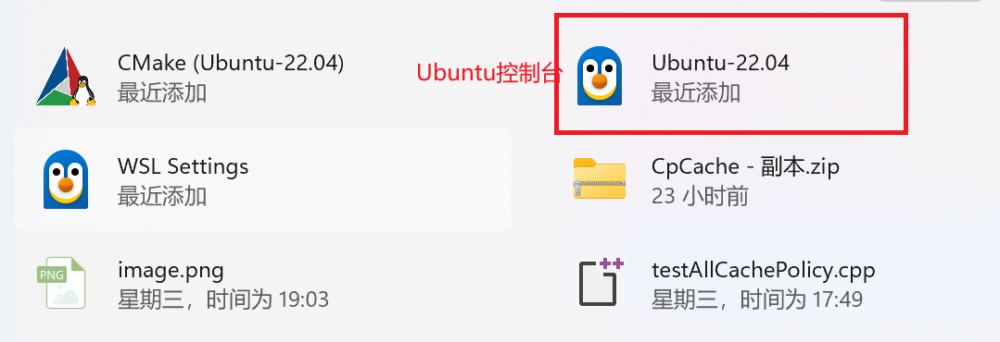

# 编译运行
或许各位习惯在visual studio或者一些代码网站上完成代码并直接运行，但对于这样大量头文件和代码量的代码来说，在自带的编译器上不太可行，我们需要安装一些额外的环境来适应。
提前声明：作者也是计算机小白，很多操作同样不太了解，这里只是给出我完成编译与运行时做的

## linux环境
`Ubuntu 22.04 LTS`
可以参考一下
[Ubuntu安装](https://blog.csdn.net/weixin_51949030/article/details/144729352?spm=1001.2014.3001.5506)
如果只是为了完成测试看第一部分即可
## Cmake安装
CMake是一个跨平台的编译(Build)工具,可以用简单的语句来描述所有平台的编译过程。

CMake能够输出各种各样的makefile或者project文件，能测试编译器所支持的C++特性,类似UNIX下的automake。

安装完Ubuntu后，可以在控制台中输入一下命令直接安装  
`sudo snap install cmake --classic`
可以通过以下命令检查是否安装成功  
`cmake --version`

## 正式编译与运行
按照以下方式运行即可  
### 创建一个build文件夹并进入
`mkdir build && cd build`

### 生成构建文件
`cmake ..`

### 构建项目
`make`

### 如果要清理生成的可执行文件
` make clean`

### 运行
`./main`