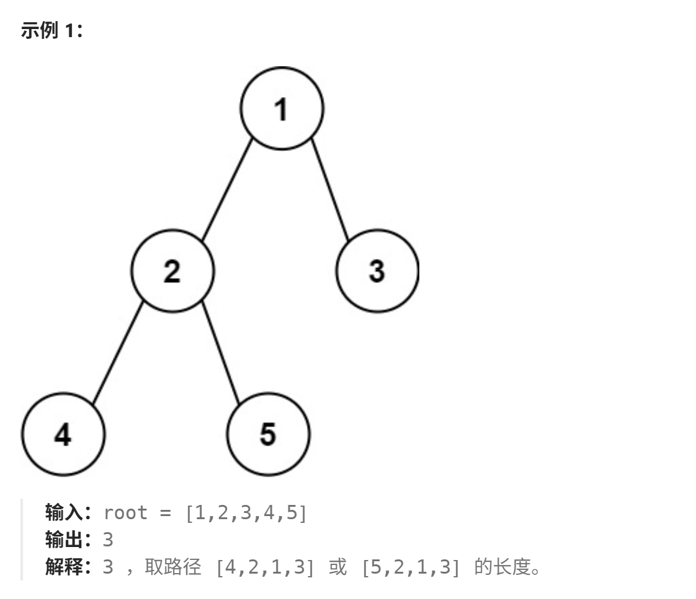

# 二叉树的直径
[二叉树的直径](https://leetcode.cn/problems/diameter-of-binary-tree/description/?envType=study-plan-v2&envId=top-100-liked)

虽然说是简单题，不过有点思维能力在里面，各位可以试着自己想想怎么做？

我给出的解释是计算出每个节点的左右子树高度和，最大的为二叉树的直径，各位要注意直接是计算路径而不是节点，也就是节点直接连接的直线数

可以这样理解


比如根节点"1"它的左孩子"2"的高度为2，并且到空节点位置我们的左端有两条直线，右孩子"3"同理

作者确实花了极短的时间就想出了思路，但这不代表这道题好想，各位在积累一定题量后一定也会对一些题有直感的

```
/**
 * Definition for a binary tree node.
 * struct TreeNode {
 *     int val;
 *     TreeNode *left;
 *     TreeNode *right;
 *     TreeNode() : val(0), left(nullptr), right(nullptr) {}
 *     TreeNode(int x) : val(x), left(nullptr), right(nullptr) {}
 *     TreeNode(int x, TreeNode *left, TreeNode *right) : val(x), left(left), right(right) {}
 * };
 */
class Solution {
public:
    int result=0;
    int height(TreeNode* node)
    {
        if(node==nullptr)
            return 0;
        int lf=height(node->left);
        int rt=height(node->right);
        result=max(result,lf+rt);
        return max(lf,rt)+1;
    }
    int diameterOfBinaryTree(TreeNode* root) {
        //判断左右子树的高度和在哪一个节点处最大
        if(root==nullptr)
            return result;
        height(root);
        return result;
    }
};
```