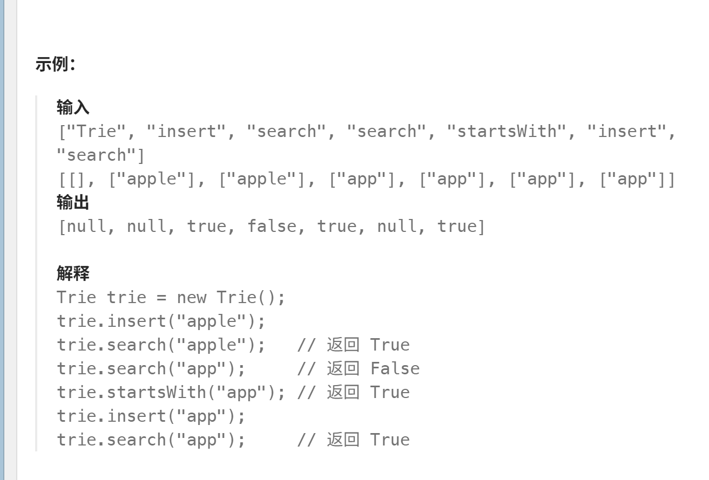
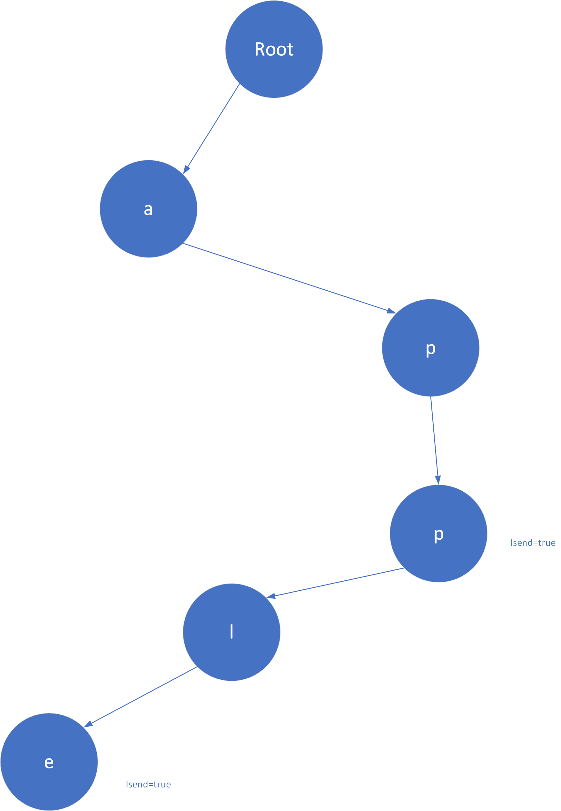

# 实现前缀树
[实现前缀树](https://leetcode.cn/problems/implement-trie-prefix-tree/description/?envType=study-plan-v2&envId=top-100-liked)

看起来很唬人的题目，也许各位第一次看可能想不出好的方法，不过实现的思路不算难。

## 解析
虽然这里是图论的章节(一般来说除了空树都把树算作图的一种)，但既然是树就用树的思维去解决

根据题意我们需要构造一颗二十六叉树（你也可以叫它26叉链表），请不要害怕，我们不会写26个孩子节点，使用指针数组就可以解决

或许使用例子说明会更好理解



只有想清楚节点的构造后面就顺理成章了
```
struct Node
{
    Node * son[26]{};//26分支，这里要初始化的
    bool isend=false;//标记该位置是否是单词结束位置  
}
```

## 代码
```
class Trie {
private:
    struct Node{
        Node* son[26]{};//对应26个字母
        bool isend=false;//标记是否有单词在这里结束
    };
    Node* root;
    int find(string word)
    {
        Node * cur=root;
        for(char c:word)//遍历单词
        {
            c-='a';
            if(cur->son[c]== nullptr)
                return 0;//不匹配

            cur=cur->son[c];
        }
        if(cur->isend) return 2; //有单词在这里结束，说明是完全匹配
        return 1;
    }

    void destory(Node* node) //和二叉树删除节点一样
    {
        if(node==nullptr)
            return ;

        for(Node* nextnode : node->son)
        {
            destory(nextnode);
        }

        delete node;//后序删除
    }

public:
    ~Trie() //虽然题目没有要求但我们最好也实现一下
    {
        destory(root);
    }

    Trie() {
        root=new Node;
    }
    
    void insert(string word) {
        Node* cur=root;

        for(char c :word)
        {
            c-='a';
            if(cur->son[c]==nullptr)//没有后续自己自己构造了
            {
                cur->son[c]=new Node;
            }
            cur=cur->son[c];
        }
        cur->isend=true;//标记为一个单词的结束，注意这里不一定是叶子节点
    }
    
    bool search(string word) {
        return find(word)==2;//只有看到isend才说明存储了这个单词
    }
    
    bool startsWith(string prefix) {
        return find(prefix)!=0;//注意单词本身也是自己的前缀
    }
};

/**
 * Your Trie object will be instantiated and called as such:
 * Trie* obj = new Trie();
 * obj->insert(word);
 * bool param_2 = obj->search(word);
 * bool param_3 = obj->startsWith(prefix);
 */
```

图论章节完成！
