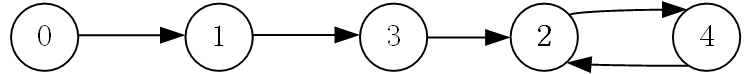
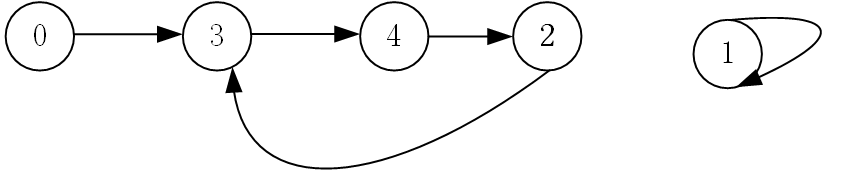

# 寻找重复数
[寻找重复数](https://leetcode.cn/problems/find-the-duplicate-number/description/?envType=study-plan-v2&envId=top-100-liked)

这道题不是我能想出来的，或者说正常人会这样想吗？
在我朦胧的记忆里面，有一个趣味谜题短片有类似的思路

## 解析
好吧话不多说，这道题和前面的[环形链表II](https://leetcode.cn/problems/linked-list-cycle-ii/?envType=study-plan-v2&envId=top-100-liked)其实是一种类型的

很不可思议吗？
因为我们的数组在[1,n]之间，但是有n+1个数，这代表一定有一个重复的没错，但是各位思考一下，有这样的有向图的，节点是这样的，第i个节点的指向nums[i]个节点,要保证它没有环，最多只能有多少个数，答案是最多n个，一旦多出一个，就会有节点重复指向一个节点

这代表存在环，并且重复指向的那个节点就是我们要找的重复数，也就是环的入口？

我们举例来说明吧！
比如[1,3,4,2,2]

2为重复数

再比如[3,1,3,4,2]

3为重复数

不可思议的算法


## 代码
```
class Solution {
public:
    int findDuplicate(vector<int>& nums) {
        //不可思议的思路

        int slow=0;
        int fast=0;
        while(true)
        {
            slow=nums[slow]; //类似于slow=slow->next
            fast=nums[nums[fast]];//类似于fast=fast->next->next

            if(slow==fast)//如果相遇证明在环中
                break;
        }

        int head=0;
        while(slow!=head) //放置一个head查找环的入口
        {
            slow=nums[slow];
            head=nums[head];
        }

        return slow; //相遇点就是环的入口，也就是我们寻找的重复数
    }
};
```

时间复杂度O(n)
空间复杂度O(1)

## 尾声
还想说点什么，但不知道说什么好了，作者仅仅是为了考研复试而练习的普通大学生，感谢你们能够看到这里，感谢一直以来的包容和理解，虽然作者水平很烂，但是有人能看我的题解真是太好了。人与人之间因为奇妙的事情相遇，因为其他的事情分离，或许生活总是个环吧，或许我们还会再次相遇，短暂地告别是为了下一次的相遇。嗯，做得好！
