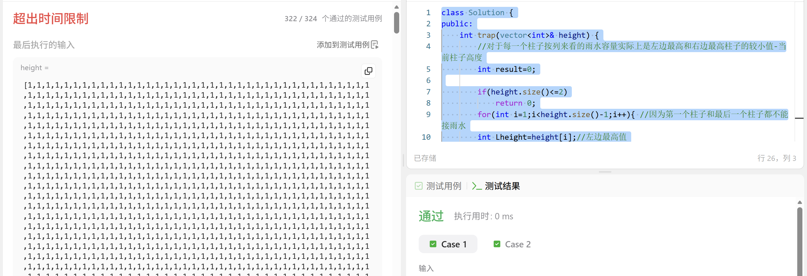
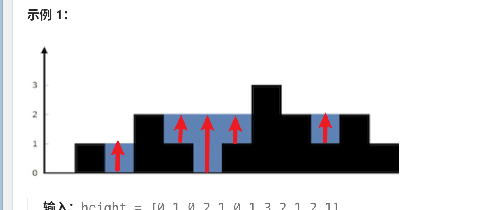
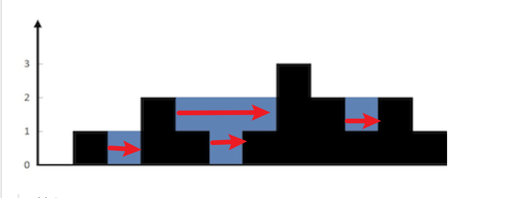

# 接雨水
[接雨水](https://leetcode.cn/problems/trapping-rain-water/?envType=study-plan-v2&envId=top-100-liked)
应该是最常见的一类题目了，总之核心思路是按列来思考，每一个的雨水量为左边最高高度与右边最高高度的较小值-当前柱子高度

## 暴力算法
很显然我们知道这个公式之后可以来完成暴力算法
```
class Solution {
public:
    int trap(vector<int>& height) {
        //对于每一个柱子按列来看的雨水容量实际上是左边最高和右边最高柱子的较小值-当前柱子高度
        int result=0;

        if(height.size()<=2)
            return 0;
        for(int i=1;i<height.size()-1;i++){ //因为第一个柱子和最后一个柱子都不能接雨水
        int Lheight=height[i];//左边最高值
        int Rheight=height[i];//右边最高值

        for(int j=i-1;j>=0;j--){
            Lheight=max(Lheight,height[j]);
        }

        for(int j=i+1;j<height.size();j++){
            Rheight=max(Rheight,height[j]);
        }
        int v=min(Rheight,Lheight)-height[i];
        result+=v;

        }
        return result;
    }
};
```

时间复杂度O(n²)
空间复杂度O(1)
可惜被力扣无敌测试击败


## 双指针优化
说是双指针，但是更像是前缀和？
总之各位清楚这里实际上预处理了左边最值和右边最值就足够了，实际上是经典的空间换时间
```
class Solution {
public:
    int trap(vector<int>& height) {
        if(height.size()<=2)
            return 0;
        int result=0;

        vector<int> maxl(height.size(),0);//左边最大值
        vector<int> maxr(height.size(),0);//右边最大值

        maxl[0]=height[0];
        maxr[height.size()-1]=height[height.size()-1];//初始化

        for(int i=1;i<height.size();i++){//左遍历
            maxl[i]=max(maxl[i-1],height[i]);
        }

        for(int i=height.size()-2;i>=0;i--){//右遍历
            maxr[i]=max(maxr[i+1],height[i]);
        }

        for(int i=1;i<height.size()-1;i++){
            int v=min(maxl[i],maxr[i])-height[i];//一样的公式
            if(v <0)
                continue;
            result+=v;
        }
        return result;

    }
};
```
时间复杂度O(n)
空间复杂度O(n)
这是很标准也是很优秀的思路了，即使是困难题也可以使用这种思路来解决

应该还有一种单调栈的写法，作者要是想起来就回来更新（大概

## 单调栈
各位中午好，因为要重新整理hot100居然想起来写了，其实如果学习了前面的双指针这里不算难理解，我们的核心逻辑是找到当前柱子的左右最近比它高的柱子其中的较小值(还是感觉有点绕啊)
这里和各位再提一嘴，我们接雨水有两种计算模式。在前面的双指针我们使用的是按列计算模式
应该长这样的


在本题单调栈我们需要按行计算


这还是由于我们栈的特性。好的，我们需要实现一个维护单调递减的单调栈，我们触发计算体积是根据进入元素高于栈顶元素，这样我们可以满足左边右边都比中间大的情况(左边在哪里？左边就是栈顶元素弹出后的栈顶)
只要我们知道左右下标我们就知道这个矩形的宽，而只要我们知道左右高度和当前mid的高度我们就可以知道矩阵的高，自然也就知道雨水面积了
一定要注意我们会一直维护单调栈从栈底到栈顶的降序，这样才能保证"左"一定会高于中间。

```
class Solution {
public:
    int trap(vector<int>& height) {
        //也可以使用单调栈的方式来完成
        stack <int> st;//维护一个单调递减的栈
        int result=0;

        for(int i=0;i<height.size();i++)
        {
            while(!st.empty() && height[i] >height[st.top()])
            {
                int mid=height[st.top()];
                st.pop();
                if(!st.empty()) //如果是栈空的情况无法计算，因为没有左柱子
                {
                    int left=st.top();
                    int w=i-left-1;//宽度
                    int h=min(height[i],height[left])-mid;//选择左右柱子中较小值
                    int v=h*w;
                    result+=v;
                }
            }
            st.push(i);
        }

        return result;
    }
};
```