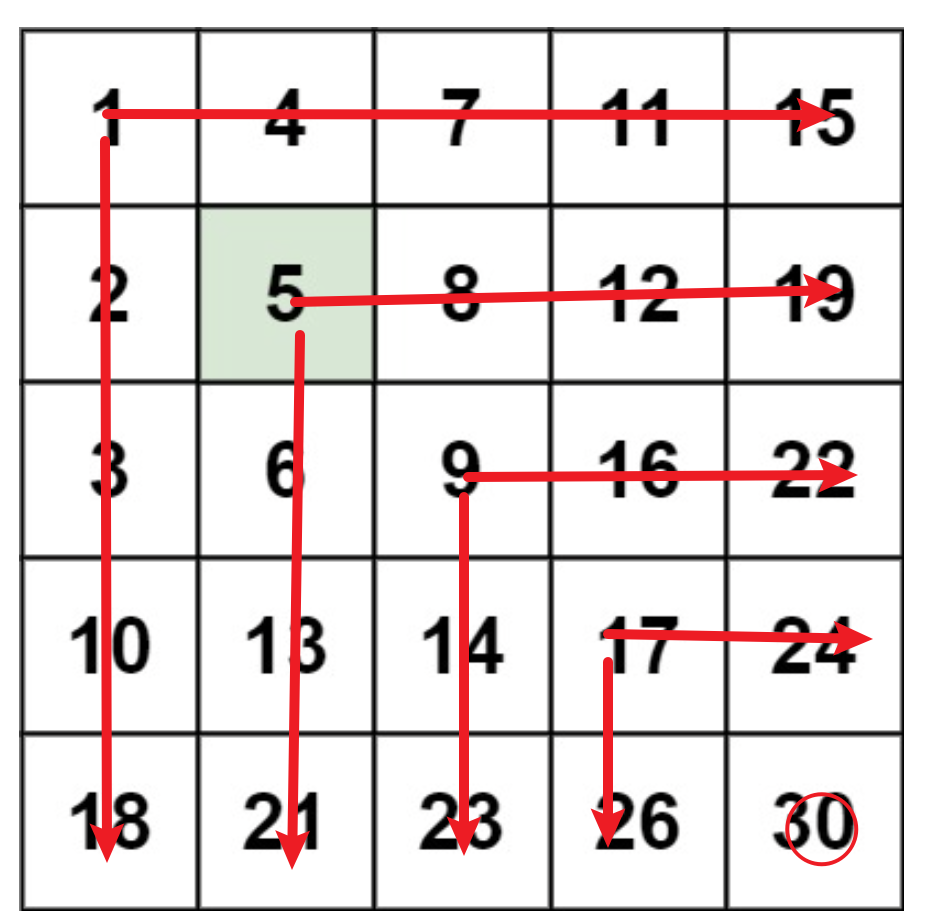

# 搜素二维矩阵II
[搜索二维矩阵II](https://leetcode.cn/problems/search-a-2d-matrix-ii/?envType=study-plan-v2&envId=top-100-liked)

"我只会这个"

作者在自己做时确实想不到什么好方法，总之大道至简，看到升序使用我们的二分查找只是没有错的

## 二分查找
搜索逻辑如下



```
class Solution {
public:
    bool binary_serach_row(vector<vector<int>>& matrix,int row,int n,int target){ //对于一行的二分差值
        int low=row;
        int high=n-1;
        while(low <=high){
            int mid=(low+high)/2;
            if(matrix[row][mid]==target)
                return true;
            if(matrix[row][mid]<target)
                low=mid+1;
            else
                high=mid-1;
        }
        return false;
    }

    bool binary_serach_col(vector<vector<int>> &matrix,int col,int m,int target)//对于一列的二分查找
    {
        int low=col;
        int high=m-1;
        while(low <=high){
            int mid=(low+high)/2;
            if(matrix[mid][col]==target)
                return true;
            if(matrix[mid][col]<target)
                low=mid+1;
            else
                high=mid-1;
        }
        return false;
    }


    bool searchMatrix(vector<vector<int>>& matrix, int target) {
        
        int m=matrix.size();
        int n=matrix[0].size();
        
        int border=min(m,n);
        for(int i=0;i<border;i++){
            if( binary_serach_row(matrix,i,n,target) || binary_serach_col(matrix,i,m,target))
            return true;
            
        }
        return false;


    }
};
```

二分查找属于基本功，总之各位当然可以使用这种不需要过多思考的方法来实现

时间复杂度:O(min(m, n) * log(mn))
空间复杂度:O(1)


## 技巧
技巧就是从右上角开始查找，然后直接去掉一行或者一列
作者也是偷看的题解，各位也可以自己看看
```
class Solution {
public:
    bool searchMatrix(vector<vector<int>>& matrix, int target) {
        int  m=matrix.size();
        int n=matrix[0].size();

        int i=0;
        int j=n-1;
        while(i <m && j>=0 ){
            if(matrix[i][j]==target)
                return true;
            
            if(matrix[i][j] <target) //说明这一行都小于target
                i++;//下移一行
            else //说明这一列都大于target
                j--;//左移一列
        }
        return false;
    }
};
```

时间复杂度:O(m+n)
空间复杂度:O(1)


