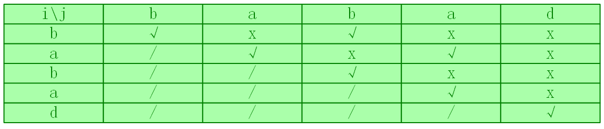
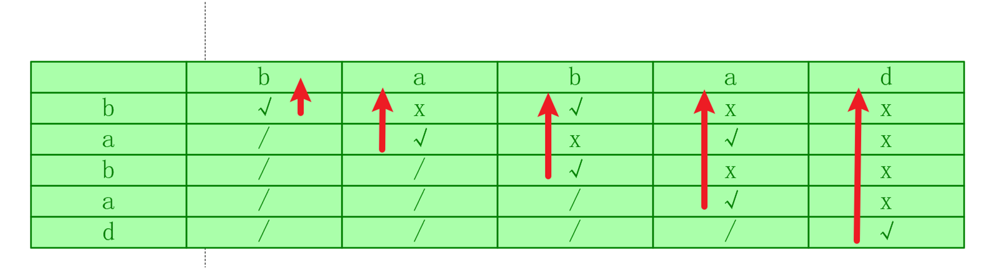

# 最长回文子串
[最长回文子串](https://leetcode.cn/problems/longest-palindromic-substring/description/?envType=study-plan-v2&envId=top-100-liked)

## 解析
我们先来理解一下回文的条件，对于一个字符串是否是回文的，其实只需要判断两个条件
1. 最外层的两个字母相同
2. 内层的子串是回文字符串
比如abcba 我们只需要判断左端和右端的'a'相同，并且"bcb"是回文字符串即可

为什么要这样做？因为我们在拆分最优子结构！我们只能知道bcb是回文子串，因为**前面已经算过了**

各位也知道我们本章叫做多维动态规划，所谓多维一般指二维或更高级的dp数组
那么我们的dp数组应该怎么设置呢？
给出结论dp[i][j]表示字符串s在[i,j]是否是回文串

在寻找状态转移方程之前我强烈建议各位先试着凭借经验实现一个字符串的dp数组，或许你就可以发现规律
以题目的例子"babad"为例


你或许可以发现一下规律：
1. 斜对角线(i=j)一定是回文子串，因为只有一个字母
2. 当出现[i,j]范围是三个及以上时，我们根据前面的结论，判断s[i]==s[j] && dp[i+1][j-1]==true
3. 当j-i==1，就只需要判断s[i]==s[j]

到这里已经很清晰了
1. **确定dp数组与下标的含义**：dp[i][j]表示[i,j]是否为回文子串
2. **确定递推公式**:根据上面提到的三种情况更新
3. **dp数组初始化**：先全部初始化为false
4. **确定遍历顺序** :相当值得一提，各位可能觉得这道题先按行遍历，这样就错误了，比如我们先判断第一行[0,4]问题来了 ，[1,3]我们没有更新！
所以正确的更新方式应该是如图所示  

5. **举例推导dp数组**：上面已经举例了

## 代码
```
class Solution {
public:
    string longestPalindrome(string s) {
        // 研究[i,j]是否是回文子串需要满足两个条件
        // 1.s[i]=s[j]
        // 2.[i+1,j-1]是回文子串

        int maxlen = 0;
        string resultstr;
        vector<vector<bool>> dp(s.size(), vector<bool>(s.size(), false));

        for (int j = 0; j < s.size(); j++) {
            for (int i =j; i >=0; i--) {
                if (i == j) {
                    dp[i][j] = true;
                    if (maxlen < j - i + 1) {
                        maxlen = j - i + 1;
                        resultstr = s.substr(i, j - i + 1);
                    }
                } else if (j - i == 1) {
                    if (s[i] == s[j]) {
                        dp[i][j] = true;
                        if (maxlen < j - i + 1) {
                            maxlen = j - i + 1;
                            resultstr = s.substr(i, j - i + 1);
                        }
                    }
                } else {
                    if (s[i] == s[j] && dp[i + 1][j - 1] == true) {
                        dp[i][j] = true;
                        if (maxlen < j - i + 1) {
                            maxlen = j - i + 1;
                            resultstr = s.substr(i, j - i + 1);
                        }
                    }
                }
            }
        }

        return resultstr;
    }
};
```

时间复杂度O($n^2$)
空间复杂度O($n^2$)