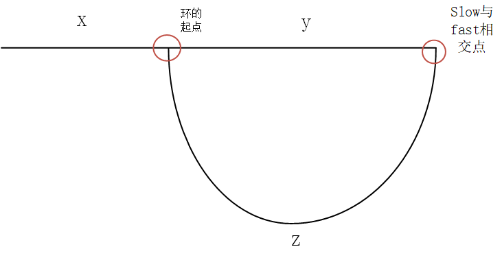

# 环形链表II
[环形链表II](https://leetcode.cn/problems/linked-list-cycle-ii/description/?envType=study-plan-v2&envId=top-100-liked)

和上一题一样，这道题是可以通过set简单完成的

## set集合
```
/**
 * Definition for singly-linked list.
 * struct ListNode {
 *     int val;
 *     ListNode *next;
 *     ListNode(int x) : val(x), next(NULL) {}
 * };
 */
class Solution {
public:
    ListNode *detectCycle(ListNode *head) {
        unordered_set <ListNode*> set;
        ListNode* cur=head;
        while(cur!=NULL){
            if(set.find(cur)!= set.end()){//当再次找到第一个相同点时
                return cur;
            }
            set.insert(cur);
            cur=cur->next;
        }
        return NULL;


    }
};
```

## 快慢指针
### 解析
我们知道快慢指针可以用来判断环，但问题是快慢指针相交的点并不一定是环的起点，但是这个相交点和环的起点有什么关系呢(⊙_⊙)？

这其中是有点难想的数学推导，如图:


我们实际上要找到x之后的那一个点，就是环的起点

我们思考一下slow走了多长
实际上是x+y

那fast呢
实际上是x+y+n(y+z),因为fast会在环里面至少绕一圈再和slow相遇

然后fast走的是slow的两倍
x+y+n(y+z)=2(x+y)

化简一下x=z+(n-1) (y+z)

这是什么意思？也就是x的距离等于z加上n-1倍这个环
也就是说如果有一个点index1从起点开始，另一个点index2从相交点开始，在index2走上若干次这个环后，就一定会在环的起点和  index相遇呢
很神奇吧！

这个世界可能是环，我们会在后面再一次遇到这道题
### 代码
```
/**
 * Definition for singly-linked list.
 * struct ListNode {
 *     int val;
 *     ListNode *next;
 *     ListNode(int x) : val(x), next(NULL) {}
 * };
 */
class Solution {
public:
    ListNode *detectCycle(ListNode *head) {
        ListNode *fast =head;
        ListNode *slow=head;
        //确定相交点
        while(fast!=NULL){
            slow=slow->next;
            fast=fast->next;
            if(fast!=NULL)
                fast=fast->next;

            if(fast==slow)
                break;
        }
        //没有环的情况
        if(fast==NULL)
            return NULL;
        //确定环起点
        ListNode *index1=head;
        ListNode *index2=slow;
        while(index1!=index2){
            index1=index1->next;
            index2=index2->next;
        }

        return index1;
        
    }
};
```

所以说人与人的相遇真是奇迹呢
