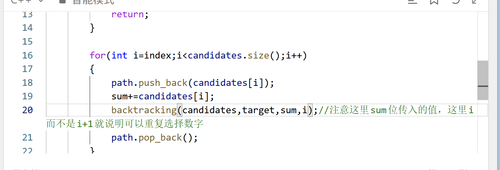

# 组合总和

[组合总和](https://leetcode.cn/problems/combination-sum/description/?envType=study-plan-v2&envId=top-100-liked)

## 解析

这道题和前面电话号码的区别是可以选择重复元素，其实也是经典套路，我们使用index是为了避免出现重复的组合，我们在每一层递归里面传入index+1或者i+1是为了避免选择重复的元素，现在只需要传入i或者index即可

这样想这道题其实不难

回溯递归三步：
1. 确定参数：传入搜索数组candidates，目标target，当前总和sum，当前搜索下标index
2. 确定终止条件：当sum==target了收集并返回，当sum>target，因为candidates里只有正数所以直接返回
3. 单层逻辑，根据index遍历后面的candidates,注意传入的是i而不是i+1

另外值得一提的是，回溯是回溯函数不方便恢复的值，比如path这种，但是sum本身就是函数的参数，函数在退栈时实际上就是回溯的过程，请不要盲目记忆套路而是仔细理解回溯的过程

另外 请小心这种写法，当你的sum并非引用时

这样的写法是错误的，这涉及到一些拷贝知识

## 代码
```
class Solution {
public:
    vector<vector<int>> result;
    vector<int> path;
    void backtracking(vector <int>& candidates,int target,int sum,int index)
    {

        if(sum >target) //超过当前数值时需要退出防止无限递归
            return;
        if(sum==target)
        {
            result.push_back(path);
            return;
        }

        for(int i=index;i<candidates.size();i++)
        {
            path.push_back(candidates[i]);
            backtracking(candidates,target,sum+candidates[i],i);//注意这里sum位传入的值，这里i而不是i+1
            path.pop_back();
        }
    }


    vector<vector<int>> combinationSum(vector<int>& candidates, int target) {
        backtracking(candidates,target,0,0);

        return result;
    }
};
```
