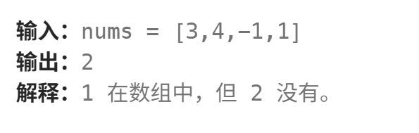

# 缺失的第一个正数
[缺失的第一个正数](https://leetcode.cn/problems/first-missing-positive/description/?envType=study-plan-v2&envId=top-100-liked)

这道题是作者在考研学习数据结构时见过的原题，虽然这里要求变强了，但是在困难题目里面实际上算简单的（？）

## 哈希表统计
朴实无华，经典的操作
```
class Solution {
public:
    int firstMissingPositive(vector<int>& nums) {
        //使用哈希表来轻松完成这道题吧
        //检查这个数组的最大值，然后构造哈希表
        //记录第一个出现的整数
        int maxval=1;
        for(int i=0;i<nums.size();i++){
            maxval=max(maxval,nums[i]);
        }

        unordered_map<int,int> hash;//我们采用了unordered_map来作为哈希表统计，这是因为原来的数组哈希表会直接内存爆炸

        for(int i=0;i<nums.size();i++){
            if(nums[i]>0)
                hash[nums[i]]++;
        }

        int result=1;
        for(int i=1;i<=maxval;i++){
            if(hash.find(i)!=hash.end())
                result++;
            else
                return result;
        }

        return result;

    }
};
```
时间复杂度O(n)
空间复杂度O(n):这里可能因为测试案例的原因变成O(n)，所以实际上不算是完全解决这道题，不过不失为一个优秀的思路

## 原地哈希
其实作者在之前也不会这种方法，不过确实值得学习。首先提出的问题是一个数组有n的长度，它可能最大的未出现整数是多少？答案是n+1也就是例如[1,2,3]  结果应该是4，所以我们只需要考虑出现在1-n的数字即可

接下来说明原地哈希，我们建立哈希表的目的是**让1-n的数组出现在对应的位置**对吧，这其实好办，比如当我们找到一个2，我们把他和第二个下标(所以是下标1)交换就行

比如这样一个例子  

[3,4,-1,1]
[-1,4,3,1]
[-1,1,3,4]
[1,-1,3,4]
当我们检查到下标1时，我们就会发现少了2，返回2即可

最后值得一提的是如果有重复数字也无所谓，我们的目标是让对应位置有这个数字，只要有其中一个数字出现在这个位置上就行，其他重复的数字爱排那里排那里

记住我们每一次操作都只在做一件事，让符合要求的数字出现在对应位置上

```
class Solution {
public:
    int firstMissingPositive(vector<int>& nums) {
        int n=nums.size();

        for(int i=0;i<n;i++){
            //这里选择while而不是if，是因为交换后的数字也可能不是对应位置的
            //这里是为了避免重复数字的问题，我们只需要一个对应数字放在对应位置即可
            while(nums[i]>0 && nums[i]<=n && nums[i]!=nums[nums[i]-1]){
                swap(nums[i],nums[nums[i]-1]);
            }
        }

        for(int i=0;i<n;i++){
            //检查对应位置的数字是否正确
            if(nums[i]!=i+1)
                return i+1;
        }
        //我们的数组实际上对应的是1—n的数字，如果都存在，说明应该是n+1
        return n+1;


    }
};
```

时间复杂度O(n)
空间复杂度O(1)


