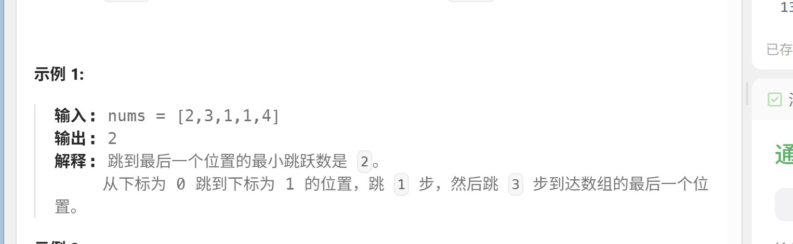

# 跳跃游戏II
[跳跃游戏II](https://leetcode.cn/problems/jump-game-ii/?envType=study-plan-v2&envId=top-100-liked)

## 动态规划
### 解析
实现贪心算法之前让我们来实现一下动态规划的思想
思路很简单，假设到达各点的跳跃次数数组为step
到达k下标的跳跃次数为step[k],能够到达k点的其他点为step[i]
step[k]=min(step[k],step[i]+1)
简单的状态转移公式，对于到达k点来说，最佳的选择就是选择一个既能够到达该点又跳跃次数最少的点显然是更佳的
### 代码
```
class Solution {
public:
    int jump(vector<int>& nums) {
        //我认为这道题有很不错的思维模式
        //对于一个点到达的最小跳跃次数，应该等于min(能到达该点其他点，到达它们的最小跳跃次数+1)

        vector <int> step(nums.size(),INT_MAX);
        step[0]=0;
        for(int i=0;i<nums.size()-1;i++)
        {
            int j=nums[i];

            for(int k=i+1;k<nums.size()&&k<=i+j;k++)
            {
                step[k]=min(step[i]+1,step[k]);
            }
        }

        return step[nums.size()-1];

    }
};
```

时间复杂度O($n^2$)
空间复杂度O(n)

## 贪心
### 解析
贪心者则是不顾一切追求最优，我们先思考一下，比如


在下标0时，我们最大可以跳跃到下标2，对于下标1和2来说最小跳跃次数都是1，也就是至少在下标2之前我们都不用考虑跳跃了，即使跳跃能够为我们带来更远的边界，我们总是说"再观望观望"
"话说蟹老板是很贪婪的老板,即使他知道增加员工(跳跃次数)能够带来更高收益(更远距离)，但不要万不得已，我们不会选择跳跃"

我们真正贪的不是最远距离，因为题目告诉我们一定可以到达，我们要做的是尽可能保留最少的跳跃次数
* maxdist:我们能够知道能够到达的最远边界
* curdist：使用当前跳跃次数可以到达的最远边界

### 代码
```
class Solution {
public:
    int jump(vector<int>& nums) {
        //既想跳得更远又想跳得最少，这种好事真的有吗？
        int jumps=0;//跳跃次数

        int maxdist=0;//最远能够到达的距离
        int curdist=0;//使用当前跳跃次数时能够到达的最远距离
        for(int i=0;i<nums.size()-1;i++)
        {
            maxdist=max(maxdist,nums[i]+i);
            if(i==curdist)
            {
                jumps++;
                curdist=maxdist;
            }

            if(curdist>=nums.size()-1)
                break;
        }

        return jumps;
    }
};
```

时间复杂度O(n)
空间复杂度O(1)


