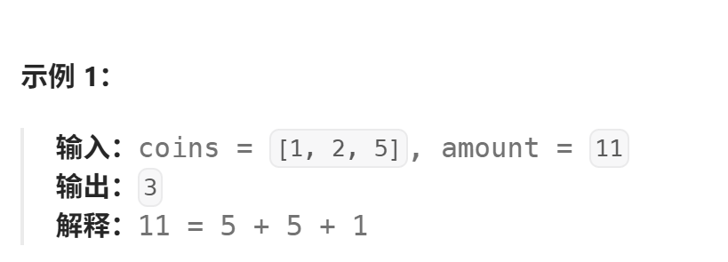

# 零钱兑换
[零钱兑换](https://leetcode.cn/problems/coin-change/description/?envType=study-plan-v2&envId=top-100-liked)

其实和上一道题很类似
其实本质上这一类题都是"完全背包"问题，可能上一道题理解不明显我放在这里讲解吧（其实是作者忘记了）
背包问题一般是这样的"有一个容量为c的背包，有若干价值为v体积(重量)为w的物品，请问如何装才能装下最多的价值"

在这里总金额amount是容量，硬币价值是重量，价值有点反向的意思，我们希望数量越少越好

而区分完全背包和01背包的关键在于，物品是否是无限的，在这里硬币可以无限使用显然是完全背包

建议各位可以先了解01背包再来完成这道题[携带研究材料](https://kamacoder.com/problempage.php?pid=1046)
作者在动态规划的[coloop-动态规划-携带研究材料](https://coloosp.github.io/mkdocs-site/算法练习/动态规划/携带研究材料/)部分也有讲解

各位只需要记住，完全背包需要先遍历背包再顺序遍历物品

## 解析
说了这么多，其实这道题的思路和上一题是一样的，
1. **确定dp数组与下标的含义** ：dp[i]指对于amount为i的金额需要的最少硬币数
2. **确定递推公式** ：dp[i]=min(dp[i],dp[i-coins[j]]+1) 注意不要超界和整型溢出问题
3. **dp数组初始化** :dp[0]=0,amount为0时不需要硬币
4. **确定遍历顺序** ：先遍历背包再遍历物品
5. **举例推导dp数组**



|         |  0  |    1    |    2    |    3    |    4    |    5    |    6    |    7    |    8    |    9    |   10    |   11    |
| ------- | --- | ------- | ------- | ------- | ------- | ------- | ------- | ------- | ------- | ------- | ------- | ------- |
| {}      | 0   | INT_MAX | INT_MAX | INT_MAX | INT_MAX | INT_MAX | INT_MAX | INT_MAX | INT_MAX | INT_MAX | INT_MAX | INT_MAX |
| {1}     | 0   | 1       | 2       | 3       | 4       | 5       | 6       | 7       | 8       | 9       | 10      | 11      |
| {1,2}   | 0   | 1       | 1       | 2       | 2       | 3       | 3       | 4       | 4       | 5       | 5       | 6       |
| {1,2,5} | 0   | 1       | 1       | 2       | 2       | 1       | 2       | 2       | 3       | 3       | 2       | 3       |


## 代码
```
class Solution {
public:
    int coinChange(vector<int>& coins, int amount) {
        vector <int> dp(amount+1,INT_MAX); //dp[i]表示面额i凑齐需要的硬币数
        dp[0]=0; //0块钱不需要凑
        for(int i=1;i<=amount;i++)
        {
            for(int j=0;j<coins.size();j++)
                {
                    if(coins[j] >i || dp[i-coins[j]]==INT_MAX) //如果无法凑齐或者硬币超过面额跳过
                        continue;

                        dp[i]=min(dp[i],1+dp[i-coins[j]]);
                }
        }

        if(dp[amount]==INT_MAX) //说明无法凑齐
            return -1;
        else
            return dp[amount];
    }
};
```

时间复杂度: O($n^2$)
空间复杂度: O(n)