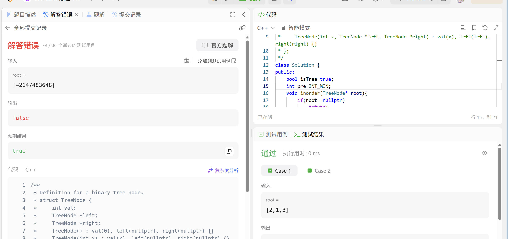

# 验证二叉搜索树
[验证二叉搜索树](https://leetcode.cn/problems/validate-binary-search-tree/?envType=study-plan-v2&envId=top-100-liked)
首先提出最核心的思想！
**二叉搜索树的中序遍历是升序序列**
这是超级重要的结论
这也是为什么上一题升序数组可以转化为二叉搜索树

也就是我们只需要不断记录当前值是否大于前驱值即可
初始前驱值pre当然设置为最小值就行
不过！这道题有神经测试案例，我们还需要使用一个isused来标记是否使用过这个前驱值


## 前驱中序判定
```
/**
 * Definition for a binary tree node.
 * struct TreeNode {
 *     int val;
 *     TreeNode *left;
 *     TreeNode *right;
 *     TreeNode() : val(0), left(nullptr), right(nullptr) {}
 *     TreeNode(int x) : val(x), left(nullptr), right(nullptr) {}
 *     TreeNode(int x, TreeNode *left, TreeNode *right) : val(x), left(left), right(right) {}
 * };
 */
class Solution {
public:
    bool isTree=true; //标记是否为二叉搜索树
    bool isused=false; //标记pre是否被更新过
    int pre=INT_MIN; //前驱值
    void inorder(TreeNode* root){
        if(root==nullptr)
            return;
        inorder(root->left);//左
        if(!isused || root->val >pre)
        {
            pre=root->val;
            isused=true;
        }
        else
        {
            isTree=false;
            return;
        }
        inorder(root->right);
    }
    bool isValidBST(TreeNode* root) {
        //二分查找的中序遍历是升序的！
        //知道这一点对于很多二叉搜索树都可以很好完成
        inorder(root);
        return isTree;
    }
};
```

时间复杂度O(n)
空间复杂度O(1)
各位也可以将其放入栈或者数组中来判定，但这样空间复杂度就会增大，或者类似单调栈一样用一个栈一直存储前驱值，不过上述写法比较简单易实现

## 前序遍历
也有一种前序递归方式来判断二叉搜索树的，可惜这里的测试案例不做人，把这种方法分享给各位吧
```
/**
 * Definition for a binary tree node.
 * struct TreeNode {
 *     int val;
 *     TreeNode *left;
 *     TreeNode *right;
 *     TreeNode() : val(0), left(nullptr), right(nullptr) {}
 *     TreeNode(int x) : val(x), left(nullptr), right(nullptr) {}
 *     TreeNode(int x, TreeNode *left, TreeNode *right) : val(x), left(left),
 * right(right) {}
 * };
 */
class Solution {
public:
    bool preorder(TreeNode* root, int maxval, int minval) {
        if (root == nullptr)
            return true;
        if (root->val >= maxval || root->val <= minval)
            return false;

        bool lf = preorder(root->left, root->val, minval); //左子树只需要小于根节点即可
        bool rt = preorder(root->right, maxval, root->val); //右子树只需要大于根节点即可
        return lf && rt;
    }
    bool isValidBST(TreeNode* root) {
        int maxval = INT_MAX;
        int minval = INT_MIN;
        return preorder(root, maxval, minval);
    }
};
```

当然各位也可以开一个LLONG_MIN来规避，不过实在没必要为了过而过，知道这样做是正确的即可

