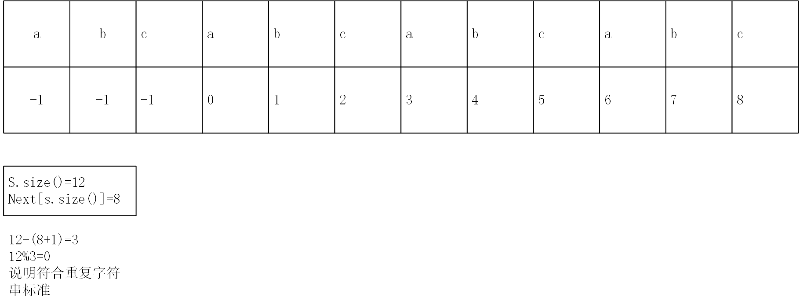

# 重复的字符串
这里需要用到KMP算法，大家也可以在B站了解一下[KMP算法](https://www.bilibili.com/video/BV1AY4y157yL/?spm_id_from=333.1007.top_right_bar_window_custom_collection.content.click)
但是，我还是先介绍一下暴力算法，
毕竟大家不能一口吃成大胖子，暴力解也是解！
## 代码（暴力）
```
class Solution {
public:
    bool repeatedSubstringPattern(string s) {
        for (int i = 0; i < s.size()/2; i++) {
            if(s.size()%(i+1)!=0)//剪枝
            continue;
            int index = 0;
            bool flag = true;
            for (int j = i + 1; j < s.size(); j++) {
                while (index <= i && j<s.size()) {
                    if (s[index++] != s[j++]) {
                        flag = false;
                    }
                }
                j--;//因为我们会在最后一次移动时多走一次，需要回退回来
                index = 0;
            }
            if (flag) {
                return true;
            }
        }

        return false;
    }
};
```
## 代码（KMP）
```
class Solution {
public:
    void getnext(vector <int> &next,const string s){
        int j=-1;
        next[0]=-1;
        for(int i=1;i<s.size();i++){
            while(j>=0 && s[i]!=s[j+1]){
                j=next[j];
            }
            if(s[i]==s[j+1]){
                j++;
            }
            next[i]=j;
        }
    }


    bool repeatedSubstringPattern(string s) {
        vector <int> next (s.size());
        getnext(next,s);
        if(next[s.size()-1] != -1 && s.size() %(s.size()-next[s.size()-1]-1) ==0 ){
            return true;
        }
        return false;


    }
};
```
## 解析
要理解KMP算法的本质，本质是前后缀的匹配，试想一个重复字符串，他的最长前后缀的长度与他本身长度之差应该是最小重复子串的长度。那么就可以被本身长度整除。
注：这里我们也使用了统一减一，实际上这样不太好理解，大家也可以按照自己的习惯完成不减一的形式

各位要知道next数组里面存储的是当前最长前后缀值（这里的next要加1）